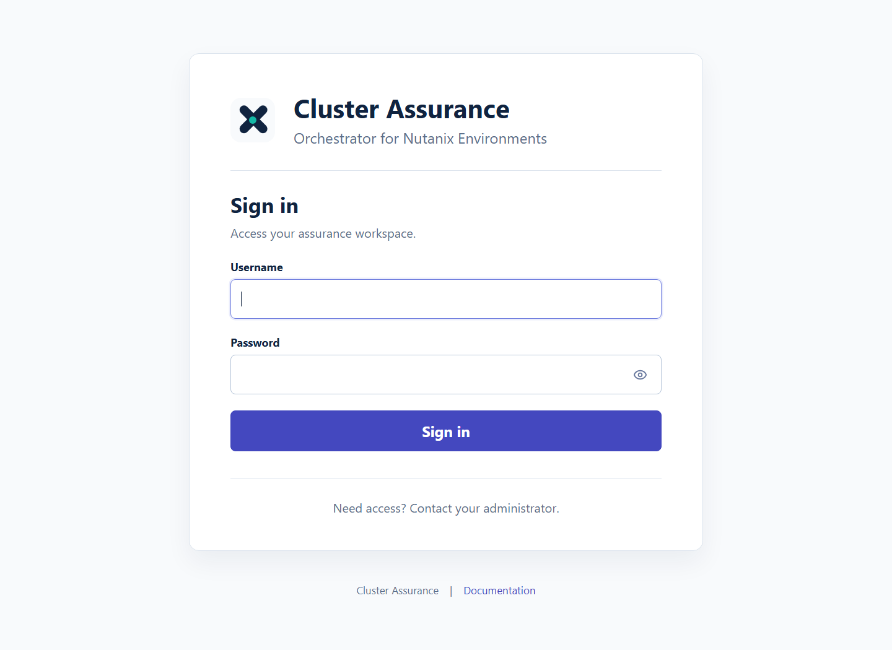

# Cluster Assurance Orchestrator for Nutanix Environments - v0.1.0

Independent operational health assurance for Nutanix environments.

Cluster Assurance Orchestrator is a read-only support console for validating Prism connectivity, collecting cluster evidence, tracking readiness gates, and giving operations teams a clear view of Nutanix estate health before production assurance claims are made.

This project is independent and is not affiliated with, endorsed by, or supported by Nutanix, Inc. Nutanix, AHV, AOS, NCC, Prism Central and Prism Element are trademarks or registered trademarks of Nutanix, Inc. in the United States and other countries.

## Live Demo

Open the public static dashboard demo on GitHub Pages:


The GitHub Pages demo is a static read-only preview with built-in sample data. It lets users explore the dashboard, triage, schedules, evidence and settings experience without requiring access to a Nutanix lab, FastAPI backend or PostgreSQL database. Use the Docker or appliance deployment when you need live Prism collection and persisted settings.

## Screenshots

### Operator Dashboard


### PostgreSQL Storage And Backups


### Login Experience



## At A Glance

| Area | Status |
| --- | --- |
| Purpose | Read-only Nutanix operational assurance, evidence capture and support triage |
| Audience | Platform, infrastructure and operational support engineers |
| Prism integration | Prism Central and Prism Element read-only API probes through configured connections |
| Persistence | PostgreSQL for Docker/appliance deployments, SQLite fallback for local development |
| Authentication | Local bearer sessions with persisted users, roles, permissions and audit events |
| Evidence | Local evidence manifests, raw collector references, archive exports and restore-drill checks |
| Current maturity | Lab-first implementation with explicit readiness gates |
| Out of scope today | Mutating Prism actions, production NCC execution over SSH, vendor support claims |

## How It Works

```text
Operator
   |
   v
React console  --->  FastAPI API  --->  PostgreSQL settings DB
   |                    |
   |                    +---- Evidence directory, archives and restore-drill records
   |                    |
   |                    +---- Read-only Prism Central / Prism Element collectors
   |
   +---- Dashboard, triage, schedules, readiness gates, audit and storage views
```

## Core Operator Workflow

1. Sign in with a local account.
2. Add Prism Central or Prism Element connections under **Settings > Connections**.
3. Test each connection with a real read-only Prism probe.
4. Start a manual health check or configure scheduled health checks.
5. Review the dashboard, operator triage, health runs, findings and evidence.
6. Use readiness gates to separate lab evidence from production-ready claims.
7. Export evidence or PostgreSQL backups for operational handover and recovery drills.

## Choose An Install Path

| Path | Use When | Command |
| --- | --- | --- |
| Docker Compose | You want the normal local or small-team deployment with PostgreSQL | `docker compose up -d --build` |
| Appliance bundle | You need a transferable ZIP with Compose files, env template, runbook and checksum | `.\scripts\build-appliance.ps1 -Version 0.1.0` |
| GitHub appliance workflow | You want GitHub to build and publish the appliance ZIP as an artifact or release asset | **Actions > Appliance Bundle** |
| Local development | You are changing backend or frontend code | Run FastAPI and Vite separately |
| Lab validation | You need to inspect live Prism response shapes before trusting collectors | `python -m app.cli.inspect_evidence_schema` |

## Docker Deployment

The Docker profile builds the React console, starts a PostgreSQL settings database and serves the UI from the FastAPI container. It persists RBAC, schedules, connection metadata, sealed secrets, storage settings and audit events in PostgreSQL. Evidence files, archives and restore-drill artifacts are stored in the `/data` volume.

```powershell
Copy-Item config\appliance.env.example config\appliance.env
docker compose up -d --build
```

Open the local appliance console at [http://127.0.0.1:8080/](http://127.0.0.1:8080/).

Before using the deployment outside disposable local testing, set strong values for:

- `CAO_AUTH_SECRET`
- `POSTGRES_PASSWORD`
- the password inside `CAO_ADMIN_DATABASE_URL`

Prism endpoint credentials should be added through **Settings > Connections** instead of being placed directly in the Compose file.

## First Login

The default bootstrap account is intended only for first-run access:

| Field | Value |
| --- | --- |
| Username | `admin` |
| Password | `ChangeMe123!` |

Change the admin password immediately after first login. If the password has already been changed, use the reset helper documented in the appliance runbook instead of editing the database manually.

## Key Features

- **Dashboard:** estate verdict, collection coverage, readiness gates, schedule status, evidence trust and operational domain cards.
- **Operator triage:** support-oriented issue list with likely cause, impact and next action.
- **Connections:** Prism Central and Prism Element profiles with sealed secrets and real read-only probe status.
- **Health runs:** manual and scheduled read-only collectors with run history and evidence references.
- **Schedules:** persisted schedules with lock and idempotency handling for due runs.
- **Evidence:** manifests, raw artifact references, retention policy, archive export and restore-drill controls.
- **Storage:** PostgreSQL health, retention summary and on-demand logical backup creation.
- **RBAC:** local users, password setting, roles, permissions and server-side enforcement.
- **Audit:** administrative event trail for sensitive operations.
- **NCC gate:** planning-only profile and parser surface; SSH execution is intentionally not implemented.

## Operational Domains

The console is designed around the views support engineers expect during Nutanix operations:

| Domain | Current Behavior |
| --- | --- |
| Inventory collection | Implemented through read-only Prism collectors |
| Storage health | Collector coverage implemented; production thresholds require lab validation |
| Hardware health | Collector coverage implemented; fault semantics require payload validation |
| Network health | Collector coverage implemented; NIC/link interpretation requires payload validation |
| Resource capacity | Collector coverage implemented; forecasting rules require historical evidence |

Storage, hardware, network and capacity monitoring are good operational additions, but they must be treated as evidence-backed assurance domains rather than decorative dashboard cards. The project currently collects coverage first, then gates deeper health claims until exact Prism response shapes and thresholds are validated.

## Local Development

Create a local Python environment, install dependencies and run the backend:

```powershell
.\.venv\Scripts\python.exe -m pytest
.\.venv\Scripts\python.exe -m uvicorn app.main:app --app-dir backend --host 127.0.0.1 --port 8000
```

Run the frontend from `frontend/`:

```powershell
npm install
npm run dev
```

The operator console reads from the API, uses bearer auth after login and can trigger read-only manual health runs when the signed-in user has the required permission.

## Lab Validation

Copy `config/local.env.example` to `config/local.env` for local lab work. The real `config/local.env` file is ignored by Git.

Run read-only lab discovery:

```powershell
.\.venv\Scripts\python.exe -m app.cli.discover_lab --env-file config/local.env
```

Run a read-only inventory collection:

```powershell
.\.venv\Scripts\python.exe -m app.cli.run_inventory --env-file config/local.env
```

Inspect saved Prism response shapes without printing full raw payload values:

```powershell
.\.venv\Scripts\python.exe -m app.cli.inspect_evidence_schema --env-file config/local.env
```

Use `CAO_TLS_MODE=insecure_skip_verify` only for lab certificates that cannot yet be validated by a custom trust bundle. Evidence from that mode is labelled lab-only.

## Appliance Bundle

Create a downloadable appliance-style ZIP:

```powershell
.\scripts\build-appliance.ps1 -Version 0.1.0
```

The bundle is written under `dist-appliance/` and includes:

- Docker Compose deployment files
- appliance environment template
- appliance runbook
- manifest and SHA-256 checksum
- Docker image tar when Docker is available and `-SkipDockerImage` is not used

See [docs/appliance.md](docs/appliance.md) for install, air-gapped transfer, backup and restore guidance.

The same bundle can be created in GitHub from **Actions > Appliance Bundle**. The workflow supports:

- manual appliance builds with a chosen version
- optional inclusion of the Docker image tar
- workflow artifacts for every run
- release assets when run from a `v*` tag or when `create_release` is selected manually

## Security Model

- Operational APIs require bearer authentication except health and login endpoints.
- Admin-only APIs cover RBAC mutation, connection management, audit viewing, retention, archive and backup controls.
- Connection secrets are sealed before persistence.
- Database credentials and local evidence paths are intentionally redacted from support-facing UI.
- Failed, empty, partial or unparsable mandatory collectors produce `UNKNOWN`, never `HEALTHY`.
- Production claims should stay blocked until readiness gates are closed and lab evidence is reviewed.

## Documentation

- [Lab validation plan](docs/lab-validation-plan.md)
- [Test matrix](docs/test-matrix.md)
- [Traceability matrix](docs/traceability.md)
- [GitHub publication guide](docs/github-publication.md)
- [Appliance runbook](docs/appliance.md)

## CI And Publication

The repository includes GitHub Actions CI for backend tests, frontend build and Docker image build. Use branches and pull requests for repository publication, then cut appliance bundles from reviewed source.

This checkout is already a Git repository. Confirm the target remote before publishing:

```powershell
git remote -v
git status --short
```
